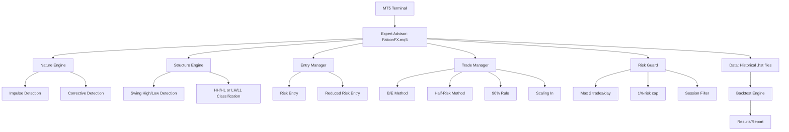

# FalconFX MT5 Bot — Project Plan

## Objective
Build an MT5 Expert Advisor (MQL5) that replicates the FalconFX Pine Script bot logic exactly — same Nature Theory, same entry types, same trade management — for local backtesting and live deployment on the onsite VM. After backtesting, forward-test on TradingView.

## Scope
- In scope:
  - MQL5 Expert Advisor with full FalconFX methodology
  - Nature Theory engine (impulsive vs corrective phase detection)
  - Market structure detection (swing highs/lows, HH/HL, LH/LL)
  - Two entry types: Risk Entry + Reduced Risk Entry
  - Trade Management: B/E method, Half-Risk method, 90% Rule, Scaling In
  - Risk guards: max 2 trades/day, 1% risk cap, session filter
  - MT5 backtesting setup with historical data
  - Documentation (README, handbook alignment, MT5-specific guide)
  - GitHub push with all files
- Out of scope:
  - Forward testing on TradingView (separate phase after backtest)
  - Prop firm integration
  - Multi-pair arbitrage
  - Dashboard/web UI

## Architecture / Data Flow

## File Map

| File | Change | Notes |
|------|--------|-------|
| `mt5/FalconFX.mq5` | added | Main Expert Advisor — full FalconFX logic |
| `mt5/FalconFX_Utils.mqh` | added | Utility functions (swing detection, patterns, structure) |
| `mt5/FalconFX_Management.mqh` | added | Trade management (B/E, Half-Risk, Scaling) |
| `mt5/README.md` | added | MT5-specific documentation |
| `mt5/backtest_setup.md` | added | How to backtest in MT5 + data download |
| `scripts/download_data.py` | added | Download historical data from Yahoo Finance for MT5 |
| `.gitignore` | modified | Ignore MT5 backtest results |

## Implementation Steps

### Phase 1: Core EA Structure
1. Create `mt5/FalconFX.mq5` — main EA with inputs matching Pine Script
2. Implement swing detection (equivalent to `ta.pivothigh/pivotlow`)
3. Implement Nature Theory engine (impulsive vs corrective classification)
4. Implement structure classification (HH/HL bullish, LH/LL bearish)

### Phase 2: Entry Logic
5. Implement Risk Entry (corrective pattern at structure edge)
6. Implement Reduced Risk Entry (break confirmation)
7. Implement candlestick patterns (engulfing, pin bar, inside bar)
8. Implement 90% rule level tracking

### Phase 3: Trade Management
9. Implement Break-Even method (move SL to entry after 1% move)
10. Implement Half-Risk method (move SL to -0.5% on corrective behavior)
11. Implement Scaling In (add on continuation after BE)
12. Implement session filter and daily trade counter

### Phase 4: Backtesting Setup
13. Create `scripts/download_data.py` — fetch OHLCV from Yahoo Finance → MT5 format
14. Create `mt5/backtest_setup.md` — step-by-step backtest guide
15. Run backtest in MT5 Strategy Tester

### Phase 5: Documentation & GitHub
16. Write MT5 README with handbook alignment
17. Push everything to GitHub

## Data Model (MT5 Specific)

| Concept | Pine Script | MQL5 Equivalent |
|---------|-------------|-----------------|
| Swing detection | `ta.pivothigh(high, len, len)` | `iHigh()` + manual comparison |
| ATR | `ta.atr(14)` | `iATR(_Symbol, PERIOD_CURRENT, 14)` |
| SMA | `ta.sma(close, 20)` | `iMA(_Symbol, PERIOD_CURRENT, 20, 0, MODE_SMA)` |
| Position entry | `strategy.entry()` | `OrderSend()` with `OP_BUY`/`OP_SELL` |
| Exit | `strategy.exit()` | `OrderSelect()` + `OrderClose()` |
| Bar index | `bar_index` | `iBars()` or loop counter |
| Timeframe | `input.timeframe("D")` | `PERIOD_D1` etc. |

## Risk Management Parameters

| Parameter | Default | Handbook Reference |
|-----------|---------|-------------------|
| Risk per trade | 1.0% | P4-5: "cap risk to 1%" |
| Max trades/day | 2 | P3-5: prevents FOMO/revenge |
| B/E trigger | 1% move or recent H/L | P20 |
| Half-Risk trigger | Corrective behavior | P21 |
| TP R:R | 3:1 | P28-30: backtest results |
| Swing lookback | 8 bars | Structure detection |
| Session filter | London + NY | Optimal liquidity |

## Open Questions
- [ ] Which pair(s) to backtest first? (EUR/JPY recommended per handbook P29)
  - Recommendation: EUR/JPY (Mark's best backtested pair, 81% strike rate)
- [ ] Which timeframe for backtest? (1H recommended)
  - Recommendation: 1H with 4H structure bias
- [ ] Do we need custom tick data for accurate backtest? (MT5 demo data may suffice for first pass)
  - Recommendation: Use built-in MT5 data, upgrade to Dukascopy if needed
- [ ] Should we implement a magic number for order tracking?
  - Recommendation: Yes, use 123456 as FalconFX magic number

## Risks & Mitigations
- **MT5 backtest data quality**: Use "Every tick" mode with real spread data for accuracy
- **MQL5 order management complexity**: Use a simple order tracking system (magic number + comment)
- **Pine Script → MQL5 logic gaps**: Test both bots on same data, compare signals
- **VM resource limits**: MT5 runs fine headless; no GUI needed for backtest

## Verification
- [ ] MT5 EA compiles without errors in MetaEditor
- [ ] Backtest runs on at least 1 year of data
- [ ] Results show ~70-81% strike rate (handbook benchmark)
- [ ] Average RR ~3:1 on winners
- [ ] Max drawdown within acceptable range (< 15%)
- [ ] All files pushed to GitHub with documentation
