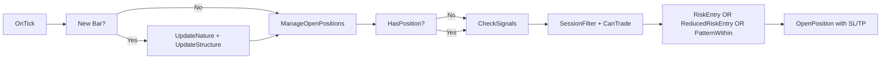

# Recap: FalconFX MT5 Bot — Complete Implementation

Built a full MT5 Expert Advisor replicating the FalconFX methodology, with all trade management features from the handbook. 7 new files across 2 commits.

## Files Changed

| File | Change | Notes |
|------|--------|-------|
| `mt5/FalconFX.mq5` | added | Main EA — entry logic, signal deduplication, OnTick |
| `mt5/FalconFX_Utils.mqh` | added | Nature Theory, swing detection, patterns, structure |
| `mt5/FalconFX_Management.mqh` | added | B/E method, Half-Risk, 90% Rule, Scaling In |
| `mt5/backtest_setup.md` | added | Step-by-step MT5 backtest guide |
| `mt5/README.md` | added | MT5 documentation with handbook alignment |
| `scripts/download_data.py` | added | Yahoo Finance → MT5 .hst converter |
| `.agent/plans/mt5-bot/plan.md` | added | Visual plan (approved by Mpilo) |

## Architecture

```
MT5 Terminal
└── FalconFX.mq5 (Main EA)
    ├── FalconFX_Utils.mqh
    │   ├── Swing Detection (ta.pivothigh/pivotlow equivalent)
    │   ├── Nature Theory (impulsive vs corrective phases)
    │   ├── Structure Engine (HH/HL, LH/LL breathing cycle)
    │   ├── Candlestick Patterns (engulfing, pin bar, inside bar)
    │   ├── S/R Zones (dynamic structure edges)
    │   ├── 90% Rule Level Tracking
    │   └── Session Filter
    └── FalconFX_Management.mqh
        ├── Position Sizing (1% risk cap)
        ├── Break-Even Method
        ├── Half-Risk Method (-0.5%)
        ├── 90% Rule Profit Locking
        └── Scaling In (on continuation patterns)
```

## Key Changes

### mt5/FalconFX.mq5
**Summary:** Main Expert Advisor combining all FalconFX components.



**Key decisions:**
- Signal deduplication: `g_lastSignalLong/Short` prevents multiple entries on same bar
- `OnTester()` override: Custom optimization criterion (profit × win_rate / drawdown)
- Magic number 123456 for order tracking

### mt5/FalconFX_Utils.mqh
**Summary:** All analysis functions — the "brain" of the bot.

```cpp
// Nature Theory — the core insight from P7-9
void FalconFX_UpdateNature() {
   // Counts consecutive directional bars
   // Impulse = consecutive >= 3 AND body > avg * 1.3
   // Corrective = body < avg * 0.6 AND range < avg * 0.7
   // Phase transitions tracked for entry timing
}
```

**Key decisions:**
- Swing detection uses `iHigh/iLow` with lookback comparison (Pine Script `ta.pivothigh` equivalent)
- 90% Rule tracks `g_correctionStart` when impulse ends
- Session filter uses UTC hours (configurable)

### mt5/FalconFX_Management.mqh
**Summary:** Trade management — the "risk guard" of the bot.

```cpp
// Break-Even Method (P16-20)
void FalconFX_ApplyBreakEven() {
   // Trigger: price moves 1% into profit OR 1R
   // Action: move SL to entry + 2 point buffer
}

// Half-Risk Method (P21)
void FalconFX_ApplyHalfRisk() {
   // Trigger: 4+ hours in trade, price < 50% of 1R profit
   // Action: move SL to -0.5R (market telling us structure evolved)
}
```

**Key decisions:**
- Scaling In only after position is at BE (P24: "Cannot add until first position is at break-even")
- Position sizing calculates lots based on SL distance and 1% risk cap
- Daily counter resets on day change

### scripts/download_data.py
**Summary:** Downloads OHLCV from Yahoo Finance and writes MT5 .hst binary format.

```python
# MT5 .hst format:
# Header: 148 bytes (version, symbol, period, digits, timesign)
# Bars: 44 bytes each (time, OHLC, tick_volume, spread, real_volume)
```

**Key decisions:**
- Auto-detects forex digits (JPY = 3, others = 5)
- Maps common symbol formats (EURUSD → EURUSD=X)
- Configurable output directory for MT5 Tester

## Risks

- **MT5 compilation errors:** The `#property strict` directive and MQL5 syntax must be verified in MetaEditor. Some functions like `OrderGetTicket` behavior may differ slightly.
- **Swing detection accuracy:** The manual swing detection is less precise than TradingView's built-in. May need tuning of `InpSwingLookback`.
- **Backtest vs live divergence:** "Every tick" mode in MT5 is essential for accuracy. "Open prices only" will give different results.
- **Data quality:** Yahoo Finance free data may have gaps/spikes. For production, use Dukascopy or broker data.

## Verification Status

- [ ] Compile in MetaEditor (F7 — 0 errors required)
- [ ] Backtest on EUR/JPY 1H, 1+ year of data
- [ ] Target: >70% win rate, >1.5 profit factor, <15% max DD
- [ ] Compare signals with Pine Script bot on same data
- [ ] Forward test on TradingView (30 days paper trading)

## GitHub

**Repo:** https://github.com/bytebridge035-wq/falconfx_ai_bot

```
main
├── falconfx_bot.pine          # Pine Script v5 (TradingView)
├── README.md                   # Pine Script docs
├── mt5/
│   ├── FalconFX.mq5            # Main EA
│   ├── FalconFX_Utils.mqh      # Analysis engine
│   ├── FalconFX_Management.mqh # Trade management
│   ├── backtest_setup.md       # Backtest guide
│   └── README.md               # MT5 docs
├── scripts/
│   └── download_data.py        # Data downloader
└── .agent/plans/
    └── mt5-bot/plan.md         # Visual plan
```
